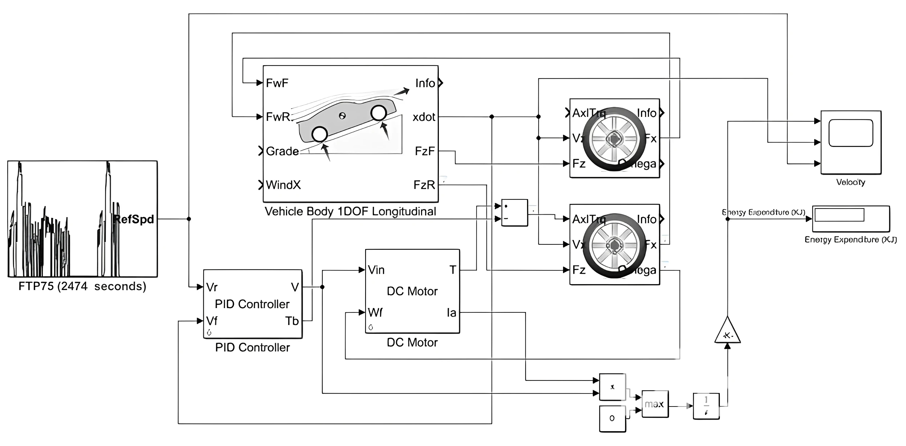
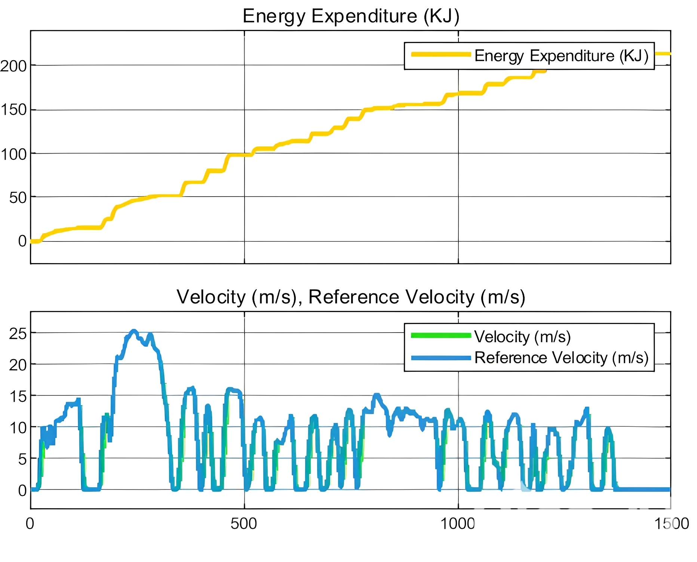
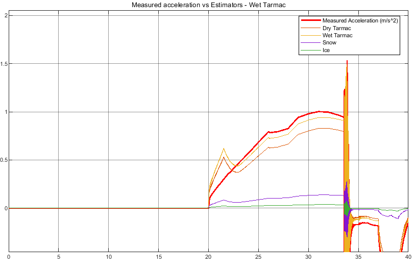

# Vehicle Power Management Simulation Report

**Modeling and Analysis of Power Consumption in Electric Vehicle Systems with Uncertain Road Conditions**

By Josué Dazogbo, Computer Engineering Student at the University of Ottawa  
Date: 10 April 2025

## Overview

This repository contains a simulation-based study of vehicle power management systems, developed using a combination of CarSim for high-fidelity vehicle dynamics simulation and MATLAB/Simulink's Vehicle Dynamics Blockset. The focus is on modeling the electro-mechanical dynamics of Electric Vehicles (EVs) to develop adaptive controllers capable of leveraging existing knoweledge of the environment to optimise the system's energy expenditure.

  
  
<em>Figure 1: Block diagram of the vehicle simulation environment in simulink</em>

## Problem Formulation

The central challenge of electric vehicle (EV) power management lies in balancing **energy efficiency** with **accurate velocity tracking**, all under **uncertain and varying road conditions**. Road friction directly affects vehicle traction, dynamics, and thus energy expenditure, yet it cannot be measured exactly in real time.  

This problem can be framed as a constrained optimization objective:

- **Velocity Tracking**: minimize the deviation between actual vehicle speed and a desired reference profile (e.g., drive cycles).  
- **Energy Efficiency**: minimize total energy consumption over the driving cycle.  

  
  
<em>Figure 2: Example Drive cycle used to assess the performance of a controller</em>

The mathematical models of vehicle motion (Newton’s law), tire-road dynamics (Pacejka’s Magic Formula), and motor electrical dynamics (armature equations) serve as the foundation. These are combined into a linearized state-space system, where the control input is the motor voltage and the main measured output is vehicle velocity.  

The presence of nonlinearities, external disturbances, and uncertain coefficients (e.g., road surface condition) requires robust control methods, often involving state estimation and adaptive architectures.

## Contributions

This repository demonstrates a comparative investigation of **three classical control strategies** applied to the EV power management problem:

- **PID Control**: A baseline feedback controller tuned for stability and responsiveness.  
- **LQR Control**: An optimal full-state feedback regulator minimizing quadratic costs of velocity deviation, wheel slip, and armature current.  
- **MPC Control**: A predictive controller that handles constraints explicitly, optimizing control inputs over a finite horizon.

  
  
<em>Figure 3: Model Predictive Control SIMULINK Mask </em>

To address uncertainty in the system dynamics, the project incorporates a **Multi-Model Adaptive Estimation (MMAE)** framework. Rather than requiring precise knowledge of the true road condition, MMAE estimates the effective friction coefficient and dynamically selects among pre-tuned controllers. This adaptation improves both **energy efficiency** and **longitudinal tracking performance**, outperforming fixed-gain designs under uncertain driving conditions.

  
  
<em>Figure 3: Multi-Model Adaptive Estimator (MMAE) integration design with the vehicle velocity tracking algorithm </em>

  
  
<em>Figure 4: Acceleration profile of the vehicle and the corresponding acceleration estimations by road condition</em>

## Repository Structure

The [`EVLQR`](./EVLQR) directory contains all the materials related to the Linear Quadratic Regulator (LQR)-based energy management controller. Inside, you'll find scripts such as [`GenerateLQRGains.m`](./EVLQR/GenerateLQRGains.m) for solving the LQR control problem, as well as the main Simulink model [`VehicleEnergyManagementSystem.slx`](./EVLQR/VehicleEnergyManagementSystem.slx), which implements the electric vehicle control architecture.

The [`MMAE`](./MMAE) folder includes tools and files for Multi-Model Adaptive Estimator. Of particular importance is the Simulink toolbox [`MultiModelToolbox.slx`](./MMAE/MultiModelToolbox.slx), which enables dynamic model switching and parameter estimation within the simulation environment.

The [`Ressources`](./Ressources) folder contains supporting materials for the project. Within it, the [`Images`](./Ressources/Images) subfolder holds all figures and visual assets used in the report. The [`Derivations`](./Ressources/Derivations) subfolder includes the [Vehicle and Road Friction State Space Model Derivation](Ressources/Derivations/VehicleRoadStateSpace.pdf) upon which the control problem is vehicle dynamics based.
